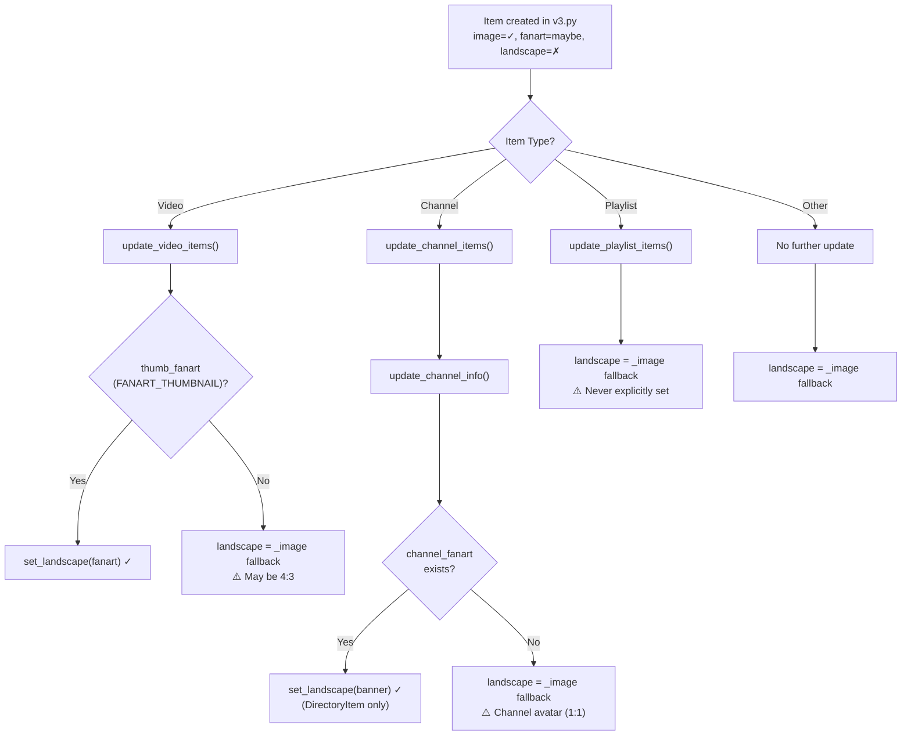

# Missing Artwork Analysis — Remaining Cases

## What Was Already Fixed (Branch `missing-landscape-artwork`)

The previous fixes addressed two root causes:

1. **Native `landscape` support** ([base_item.py#L48-L50](file:///c:/Users/lutzh/AppData/Roaming/Kodi/addons/plugin.video.youtube/resources/lib/youtube_plugin/kodion/items/base_item.py#L48-L50)): Added `_landscape` as a first-class property on `BaseItem`, with getters/setters and a fallback chain: `get_landscape(default=True)` → `_landscape` → `_image`.

2. **Phantom thumbnail filtering** ([utils.py#L1342-L1343](file:///c:/Users/lutzh/AppData/Roaming/Kodi/addons/plugin.video.youtube/resources/lib/youtube_plugin/youtube/helper/utils.py#L1342-L1343)): YouTube's API returns `fhd`, `uhd`, `4k`, `2k` thumbnail keys that resolve to 404 error images. These are now filtered in `get_thumbnail()` and in `v3.py`'s `_process_list_response`.

**These fixes correctly handle:** The case where `get_thumbnail()` picked a phantom resolution and returned a broken URL. Now it picks the best *valid* resolution (typically `maxres` or `720`).

---

## Remaining Missing Artwork Cases

After tracing the full artwork pipeline, there are **5 distinct scenarios** where artwork can still be missing:

### Case 1: Playlists never get `landscape` explicitly set

> [!WARNING]
> **Impact: ALL playlist items in every view**

In [`update_playlist_items()`](file:///c:/Users/lutzh/AppData/Roaming/Kodi/addons/plugin.video.youtube/resources/lib/youtube_plugin/youtube/helper/utils.py#L551-L558), lines 551-558:

```python
# try to find a better resolution for the image
image = get_thumbnail(thumb_size, snippet.get('thumbnails'))
playlist_item.set_image(image)

# try to find a better resolution for the fanart
if thumb_fanart:
    fanart = get_thumbnail(thumb_fanart, snippet.get('thumbnails'))
    playlist_item.set_fanart(fanart)
# ← NO set_landscape() call here!
```

Compare with `update_video_items()` at lines [1080-1082](file:///c:/Users/lutzh/AppData/Roaming/Kodi/addons/plugin.video.youtube/resources/lib/youtube_plugin/youtube/helper/utils.py#L1080-L1082):
```python
media_item.set_fanart(fanart)
if fanart:
    media_item.set_landscape(fanart)  # ← This exists for videos
```

**Result:** Playlists rely entirely on the fallback in `get_landscape(default=True)` which returns `_image`. Since playlist thumbnails are typically 4:3 ratio (`hqdefault` = 480×360), the landscape art gets a 4:3 image instead of a proper 16:9 widescreen image.

**Fix:** Add `playlist_item.set_landscape(fanart)` after line 558, matching the video pattern.

---

### Case 2: Channel items (`update_channel_items`) don't get `landscape` set directly

In [`update_channel_items()`](file:///c:/Users/lutzh/AppData/Roaming/Kodi/addons/plugin.video.youtube/resources/lib/youtube_plugin/youtube/helper/utils.py#L339-L346), lines 339-346:

```python
image = get_thumbnail(thumb_size, snippet.get('thumbnails'))
channel_item.set_image(image)

if thumb_fanart:
    fanart = get_thumbnail(thumb_fanart, snippet.get('thumbnails'))
    channel_item.set_fanart(fanart)
# ← NO set_landscape() call
```

Channel items get their landscape set later in [`update_channel_info()`](file:///c:/Users/lutzh/AppData/Roaming/Kodi/addons/plugin.video.youtube/resources/lib/youtube_plugin/youtube/helper/utils.py#L1271-L1277), lines 1271-1277:
```python
channel_fanart = channel_info.get('fanart')
if (use_channel_fanart
        or use_thumb_fanart and not item.get_fanart(default=False)):
    item.set_fanart(channel_fanart)

if channel_fanart and isinstance(item, DirectoryItem):
    item.set_landscape(channel_fanart)
```

**But this has TWO conditions that can fail:**
1. `channel_fanart` must be truthy — requires `brandingSettings.image` to have a banner URL. Not all channels set this.
2. `self._channel_fanart` must be `True` in `resource_manager.py` (line 274), which requires the setting `fanart_selection() == FANART_CHANNEL (2)`. If the user chose `FANART_THUMBNAIL (3)`, channel banners are never fetched from the API.

**Result:** With `FANART_THUMBNAIL` setting, channel items get a thumbnail fanart (from `snippet.thumbnails`) but landscape falls back to `_image` — the channel's circular avatar — which looks wrong as landscape art.

---

### Case 3: Videos only get `landscape` when `FANART_THUMBNAIL` is enabled

In [`update_video_items()`](file:///c:/Users/lutzh/AppData/Roaming/Kodi/addons/plugin.video.youtube/resources/lib/youtube_plugin/youtube/helper/utils.py#L1072-L1082), lines 1072-1082:

```python
# try to find a better resolution for the fanart
if thumb_fanart:                          # ← Only True when FANART_THUMBNAIL
    fanart = get_thumbnail(thumb_fanart, snippet.get('thumbnails'))
    ...
    media_item.set_fanart(fanart)
    if fanart:
        media_item.set_landscape(fanart)  # ← Only runs if thumb_fanart
```

When `fanart_selection()` returns `FANART_CHANNEL (2)` or `0` (disabled), `thumb_fanart` is `False`, and `set_landscape()` is never called.

**However**, the `xbmc_items.py` fallback chain partially compensates:
```python
landscape = media_item.get_landscape()           # falls back to _image
if not landscape and show_fanart:
    landscape = media_item.get_fanart(default=False)
```

So for `FANART_CHANNEL` mode:
- `get_landscape()` → `_image` (the video thumbnail) ✓ This is actually correct
- But the landscape is the same 4:3 `_image` rather than a 16:9 version selected with `THUMB_SIZE_BEST`

**Result:** In `FANART_CHANNEL` mode, video landscape uses the user's selected thumbnail size (which could be 4:3), not the best 16:9 version.

---

### Case 4: `v3.py` initial item creation never sets `landscape`

When [`_process_list_response()`](file:///c:/Users/lutzh/AppData/Roaming/Kodi/addons/plugin.video.youtube/resources/lib/youtube_plugin/youtube/helper/v3.py#L245-L251) creates items, it passes `image` and `fanart` but never `landscape`:

```python
item = VideoItem(title,
                 item_uri,
                 image=image,
                 fanart=fanart,       # ← set from get_thumbnail(fanart_type, ...)
                 plot=description,    # ← landscape is NOT passed
                 ...)
```

The `landscape` parameter exists in `BaseItem.__init__()` but is never used during v3 item construction.

For items where `update_video_items()` is subsequently called, this is corrected (Case 3). But for items that skip the update pipeline (e.g., guide categories, comments, bookmark items, command items), landscape is never explicitly set and falls back to `_image`.

---

### Case 5: Playback item metadata update doesn't set `landscape`

In [`update_media_item()`](file:///c:/Users/lutzh/AppData/Roaming/Kodi/addons/plugin.video.youtube/resources/lib/youtube_plugin/youtube/helper/utils.py#L1189-L1197), lines 1189-1197:

```python
image = get_thumbnail(settings.get_thumbnail_size(),
                      meta_data.get('thumbnails'))
if image:
    ...
    media_item.set_image(image)
# ← No set_landscape(), no set_fanart() from meta_data
```

This function updates the currently playing item's metadata from `video_stream['meta']`. It updates the image but not landscape or fanart.

**Result:** If the playback item had landscape set before, it's preserved. But if the image changes (e.g., live stream thumbnail refresh), the landscape won't match the updated image.

---

## Artwork Fallback Chain Summary



## Settings Impact Matrix

| Fanart Setting | Videos Landscape | Channels Landscape | Playlists Landscape |
|---|---|---|---|
| **Disabled (0)** | Falls back to `_image` (user's thumb size) | Falls back to `_image` (channel avatar 1:1) | Falls back to `_image` (4:3 thumb) |
| **Channel (2)** | Falls back to `_image` (user's thumb size) | Banner if available, else avatar | Falls back to `_image` (4:3 thumb) |
| **Thumbnail (3)** | ✅ 16:9 `THUMB_SIZE_BEST` | Thumbnail fanart (may be avatar), no banner | Falls back to `_image` (4:3 thumb) |

## Recommended Fixes

### Fix 1: Set landscape for playlists (high impact)
In `update_playlist_items()`, add `set_landscape(fanart)` after `set_fanart(fanart)`:

```python
# Line 558 in utils.py
playlist_item.set_fanart(fanart)
if fanart:                                    # ← ADD
    playlist_item.set_landscape(fanart)       # ← ADD
```

### Fix 2: Set landscape for channel items regardless of fanart type
In `update_channel_items()`, always select a 16:9 landscape from `snippet.thumbnails`:

```python
# After line 346 in utils.py
image_16_9 = get_thumbnail(
    settings.get_thumbnail_size(settings.THUMB_SIZE_BEST),
    snippet.get('thumbnails'))
if image_16_9:
    channel_item.set_landscape(image_16_9)
```

### Fix 3: Set landscape in v3.py initial item creation
Pass `landscape=fanart` when creating items:

```python
# Line 245 in v3.py
item = VideoItem(title,
                 item_uri,
                 image=image,
                 fanart=fanart,
                 landscape=fanart,  # ← ADD
                 ...)
```

### Fix 4: Always select a 16:9 landscape for videos regardless of fanart setting
In `update_video_items()`, decouple landscape from `thumb_fanart`:

```python
# After line 1070 in utils.py, OUTSIDE the `if thumb_fanart:` block
landscape = get_thumbnail(
    settings.get_thumbnail_size(settings.THUMB_SIZE_BEST),
    snippet.get('thumbnails'))
if landscape:
    media_item.set_landscape(landscape)
```

> [!TIP]
> Fix 4 is the most impactful single change — it ensures every video always gets the best available 16:9 thumbnail as landscape, regardless of the user's fanart setting.
