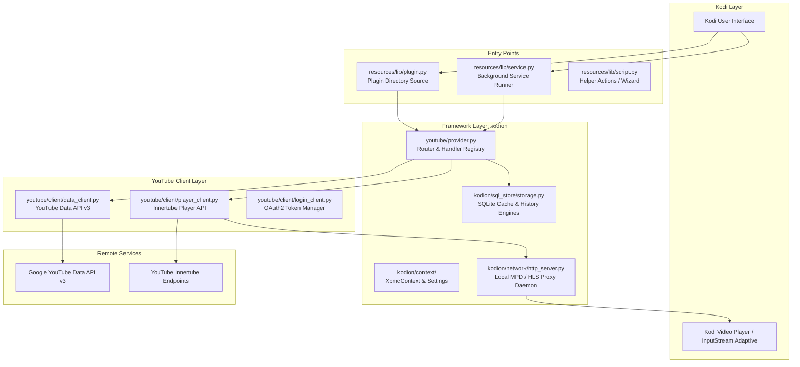
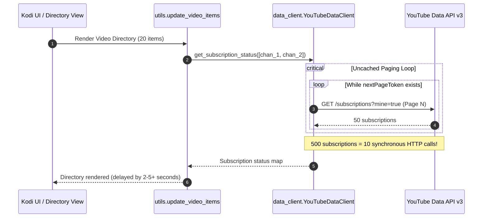

# Codebase Analysis & Action Plan: `plugin.video.youtube`

**Target Repository**: `paradigm-city/plugin.video.youtube`  
**Upstream**: `anxdpanic/plugin.video.youtube`  
**Active Branch Under Analysis**: `current_testing`  
**Target Environment**: Kodi 19 (Matrix) through Kodi 22 (Piers), Python 3.8–3.13+  

---

## Executive Summary

The `plugin.video.youtube` add-on is the primary YouTube client for the Kodi entertainment ecosystem. It bridges Kodi's Python add-on framework (`xbmc`, `xbmcgui`, `xbmcplugin`) with YouTube's public Data API v3 and internal Innertube streaming endpoints.

This analysis examines the current state of the codebase, with special focus on recent commits made on the `current_testing` branch:
* Context menu reworking and channel subscription status detection.
* SQLite database storage stability and the recent `KeyError` patch.
* Bookmarks, force refresh logic, and favorites integration.
* Core architecture, API quota usage, playback resilience, and technical debt.

---

## Architecture Overview



---

## Deep-Dive Findings & Technical Analysis

### 1. Performance & API Quota Hazard in Channel Subscription Detection

* **Files Affected**:
  * [`data_client.py:L401-L434`](file:///c:/Users/lutzh/AppData/Roaming/Kodi/addons/plugin.video.youtube/resources/lib/youtube_plugin/youtube/client/data_client.py#L401-L434) (`get_subscription_status`)
  * [`utils.py:L705-L712`](file:///c:/Users/lutzh/AppData/Roaming/Kodi/addons/plugin.video.youtube/resources/lib/youtube_plugin/youtube/helper/utils.py#L705-L712) (`update_video_items`)

#### The Problem
In recent commits for the context menu rework, [`update_video_items`](file:///c:/Users/lutzh/AppData/Roaming/Kodi/addons/plugin.video.youtube/resources/lib/youtube_plugin/youtube/helper/utils.py#L633) calls `client.get_subscription_status(...)` whenever a list of videos is built (Search results, Channel uploads, Watch History, Recommended videos, etc.) to toggle between "Subscribe" and "Unsubscribe" in the context menu.

Inside [`data_client.py`](file:///c:/Users/lutzh/AppData/Roaming/Kodi/addons/plugin.video.youtube/resources/lib/youtube_plugin/youtube/client/data_client.py#L409-L430):
```python
if self._subscription_status is None:
    subscription_ids = set()
    page_token = ''
    while True:
        json_data = self.get_subscription(
            'mine',
            page_token=page_token,
        )
        if not json_data:
            return None
        ...
        page_token = json_data.get('nextPageToken', '')
        if not page_token:
            self._subscription_status = subscription_ids
            break
```



#### Consequences
1. **Severe UI Blocking**: If a user is subscribed to 200–1,000+ channels, this loop makes 4 to 20+ sequential, synchronous HTTP requests. The Kodi UI completely freezes until every page is downloaded.
2. **Quota Exhaustion**: The default daily YouTube Data API quota is 10,000 units. Running this loop repeatedly rapidly drains the quota.
3. **Fragility & Retry Storms**: If *any* page request encounters a transient network glitch or rate limit (`if not json_data: return None`), `_subscription_status` remains `None`. Opening the next folder restarts the entire crawl from page 1.
4. **Cache Volatility**: `_subscription_status` is stored in an instance variable on the client, which is wiped whenever access tokens refresh or when Kodi restarts the Python interpreter.

#### Recommended Solutions

* **Approach A: Targeted API Query with `forChannelId` (Preferred)**
  The YouTube Data API v3 `subscriptions.list` endpoint natively accepts the `forChannelId` parameter:
  ```http
  GET https://www.googleapis.com/youtube/v3/subscriptions?part=id&mine=true&forChannelId=UC_x5XG1OV2P6uZZ5FSM9Ttw,UC...
  ```
  Instead of fetching all subscriptions of the user, send **a single query** containing only the channel IDs present on the current screen:
  ```python
  def get_subscription_status(self, channel_ids):
      if not self.logged_in or not channel_ids:
          return {}
      
      # Query only the channels needed for this view (max 50 per batch)
      channel_id_list = list(channel_ids)[:50]
      params = {
          'part': 'id,snippet',
          'mine': 'true',
          'forChannelId': ','.join(channel_id_list),
          'maxResults': len(channel_id_list)
      }
      resp = self.api_request(method='GET', path='subscriptions', params=params)
      subscribed_ids = {
          item['snippet']['resourceId']['channelId']
          for item in (resp.get('items') or ())
          if 'snippet' in item
      }
      return {cid: cid in subscribed_ids for cid in channel_ids}
  ```
  *Benefit*: 1 single API call (1 quota unit) instead of 10–20 calls. Directory loads instantaneously.

* **Approach B: Persistent SQLite Storage with TTL**
  If caching all subscriptions is desirable for offline use, store the subscription set in [`FunctionCache`](file:///c:/Users/lutzh/AppData/Roaming/Kodi/addons/plugin.video.youtube/resources/lib/youtube_plugin/kodion/sql_store/function_cache.py) or [`DataCache`](file:///c:/Users/lutzh/AppData/Roaming/Kodi/addons/plugin.video.youtube/resources/lib/youtube_plugin/kodion/sql_store/data_cache.py) with a 12-to-24-hour TTL, and populate it via a non-blocking background task.

---

### 2. SQLite Concurrency & The `KeyError` Root Cause

* **Files Affected**:
  * [`storage.py:L504-L510`](file:///c:/Users/lutzh/AppData/Roaming/Kodi/addons/plugin.video.youtube/resources/lib/youtube_plugin/kodion/sql_store/storage.py#L504-L510)
  * Commit `7d852f1b` ("fix: Corrected the SQL query to properly handle key errors in the storage module")

#### The Root Cause of `KeyError: ('SELECT * FROM storage_v2 WHERE key = ?;',)`
In commit `7d852f1b`, the following patch was added:
```python
except Exception as exc:
    if isinstance(exc, sqlite3.OperationalError):
        pass
    elif isinstance(exc, (sqlite3.InterfaceError, KeyError)):
        cursor = self._db.cursor()
```

The underlying mechanism in CPython's `sqlite3` driver:
1. When a connection is created via `sqlite3.connect(..., check_same_thread=False)`, SQLite allows the connection object to be shared across threads.
2. In Python 3.11/3.12/3.13, CPython's SQLite wrapper caches parsed SQL statements in an internal statement cache dictionary.
3. In `storage.py`, `with self._lock` was previously removed from read paths (`Storage.get()` and `Storage.get_many()`).
4. When background threads ([`service_runner`](file:///c:/Users/lutzh/AppData/Roaming/Kodi/addons/plugin.video.youtube/resources/lib/youtube_plugin/kodion/service_runner.py#L45), [`PlayerMonitor`](file:///c:/Users/lutzh/AppData/Roaming/Kodi/addons/plugin.video.youtube/resources/lib/youtube_plugin/kodion/monitors/player_monitor.py)) and the Kodi UI thread execute queries on the same connection concurrently without locking, concurrent mutations to CPython's statement cache dictionary trigger:
   ```
   KeyError: ('SELECT * FROM storage_v2 WHERE key = ?;',)
   ```
   where the dictionary key is the query tuple.

```mermaid
sequenceDiagram
    autonumber
    participant UI as Thread 1 (Kodi UI)
    participant BG as Thread 2 (Service Runner)
    participant Conn as Shared sqlite3.Connection
    participant Cache as CPython Statement Cache

    UI->>Conn: cursor.execute("SELECT * FROM storage_v2...")
    Conn->>Cache: Lookup / Insert query in Statement Cache
    BG->>Conn: cursor.execute("SELECT * FROM storage_v2...")
    Note over Conn,Cache: Concurrent dictionary mutation without threading.Lock!
    Cache-->>Conn: KeyError: ('SELECT * FROM storage_v2 WHERE key = ?;',)
    Conn-->>UI: Exception raised to storage._execute
```

#### Why Catching `KeyError` is Insufficient
* Recreating a cursor (`cursor = self._db.cursor()`) only restarts the failed query; it does not resolve the unsynchronized multi-thread data race.
* Multiple threads continuing to read/write concurrently without locking can result in SQLite database corruption, missing data, or `OperationalError: database is locked`.
* Additionally, if `self._db` is `None` (for example, when called under `ExistingDBConnection`), `self._db.cursor()` raises an `AttributeError`.

#### Recommended Solution
1. **Thread Synchronization**: Reinstate lock acquisition (`with self._lock:`) around all cursor executions (reads and writes) in [`storage.py`](file:///c:/Users/lutzh/AppData/Roaming/Kodi/addons/plugin.video.youtube/resources/lib/youtube_plugin/kodion/sql_store/storage.py).
2. **Defensive Reconnect**: In `_execute`:
   ```python
   elif isinstance(exc, (sqlite3.InterfaceError, KeyError)):
       if self._db:
           cursor = self._db.cursor()
   ```
3. **Thread-Local Connections (Long-term)**: Adopt `threading.local()` for SQLite connections so background worker threads and the main invoker thread each hold independent SQLite handles.

---

### 3. Internationalization (i18n) & Context Menu Polish

* **Files Affected**:
  * [`menu_items.py:L742-L750`](file:///c:/Users/lutzh/AppData/Roaming/Kodi/addons/plugin.video.youtube/resources/lib/youtube_plugin/kodion/items/menu_items.py#L742-L750)
  * [`utils.py:L1133-L1135`](file:///c:/Users/lutzh/AppData/Roaming/Kodi/addons/plugin.video.youtube/resources/lib/youtube_plugin/youtube/helper/utils.py#L1133-L1135)

#### 1. Localization of "Add to favourites"
```python
# Currently in menu_items.py
def add_to_favourites(context):
    return (
        'Add to favourites',
        'AddToFavourites({uri},{title},{image})'.format(...)
    )
```
* Kodi maintains built-in localized string ID `14076` for "Add to favourites".
* [`XbmcContext.localize()`](file:///c:/Users/lutzh/AppData/Roaming/Kodi/addons/plugin.video.youtube/resources/lib/youtube_plugin/kodion/context/xbmc/xbmc_context.py#L685) automatically routes string IDs below 30000 to Kodi's built-in strings.
* **Fix**:
  ```python
  def add_to_favourites(context):
      return (
          context.localize(14076, default_text='Add to favourites'),
          'AddToFavourites({uri},{title},{image})'.format(
              uri=URI_INFOLABEL,
              title=TITLE_INFOLABEL,
              image='$INFO[ListItem.Icon]',
          ),
      )
  ```

#### 2. Dead Code Cleanups
In [`utils.py:L1133-L1135`](file:///c:/Users/lutzh/AppData/Roaming/Kodi/addons/plugin.video.youtube/resources/lib/youtube_plugin/youtube/helper/utils.py#L1133-L1135):
```python
# menu_items.bookmark_add(context, media_item)
# if not in_bookmarks_list else
# None,
```
These commented-out lines inside the context menu tuple definition should be cleanly removed.

---

### 4. Innertube Playback Resilience & PO Token Support

* **Files Affected**:
  * [`player_client.py:L848-L853`](file:///c:/Users/lutzh/AppData/Roaming/Kodi/addons/plugin.video.youtube/resources/lib/youtube_plugin/youtube/client/player_client.py#L848-L853)
  * [`cipher.py`](file:///c:/Users/lutzh/AppData/Roaming/Kodi/addons/plugin.video.youtube/resources/lib/youtube_plugin/youtube/helper/signature/cipher.py)

#### Current Situation
* The JavaScript player cipher and n-sig calculation in `cipher.py` are disabled (`self._calculate_n = False`, `self._cipher = False`).
* Playback relies on Innertube client emulation (`tv`, `tv_unplugged`, `ios_testsuite_params`, `android_testsuite_params`, `android_vr`).
* **Emerging Risk**: YouTube is enforcing Proof of Origin (PO) tokens and Botguard challenges across Innertube. Clients without valid visitor data or PO tokens experience HTTP 403 Forbidden errors or bandwidth throttling.
* **Recommendation**:
  * Implement visitor data generation and PO token acquisition (similar to modern yt-dlp / NewPipe mechanisms).
  * Update [`cipher.py`](file:///c:/Users/lutzh/AppData/Roaming/Kodi/addons/plugin.video.youtube/resources/lib/youtube_plugin/youtube/helper/signature/cipher.py) with modern JS signature parsing so web and android streaming formats remain viable fallbacks when TV formats are throttled.

---

### 5. Code Modernization & Technical Debt

* **Target Kodi Versions**: Kodi 19+ (Nexus, Omega, Piers), all requiring Python 3.
* **Legacy Artifacts Present**:
  * `from __future__ import absolute_import, division, unicode_literals` in all 70+ files.
  * Python 2 compatibility shims in [`kodion/compatibility/`](file:///c:/Users/lutzh/AppData/Roaming/Kodi/addons/plugin.video.youtube/resources/lib/youtube_plugin/kodion/compatibility/) (`to_str`, `to_unicode`, `basestring`, `unicode`).
  * Python 2 class syntax: `class MyClass(object):` and `super(MyClass, self).__init__()`.
* **Monolithic Files**:
  * [`data_client.py`](file:///c:/Users/lutzh/AppData/Roaming/Kodi/addons/plugin.video.youtube/resources/lib/youtube_plugin/youtube/client/data_client.py) (~3,300 lines)
  * [`player_client.py`](file:///c:/Users/lutzh/AppData/Roaming/Kodi/addons/plugin.video.youtube/resources/lib/youtube_plugin/youtube/client/player_client.py) (~2,950 lines)
  * [`provider.py`](file:///c:/Users/lutzh/AppData/Roaming/Kodi/addons/plugin.video.youtube/resources/lib/youtube_plugin/youtube/provider.py) (~2,265 lines)
  * [`utils.py`](file:///c:/Users/lutzh/AppData/Roaming/Kodi/addons/plugin.video.youtube/resources/lib/youtube_plugin/youtube/helper/utils.py) (~1,700 lines)

**Recommendation**:
Gradually dismantle the compatibility shims, adopt modern Python 3 constructs (f-strings, type annotations), and break monolithic client files into dedicated domain components (e.g. search, subscriptions, playlists, player manifests).

---

### 6. Testing & CI/CD Infrastructure

* **Current Status**: 0 unit tests exist in the project repository.
* **CI Validation**: Only runs `kodi-addon-checker`.
* **Recommendation**:
  1. Add a `pytest` suite with lightweight Kodi mocks for `xbmc`, `xbmcgui`, `xbmcaddon`, `xbmcvfs`, and `xbmcplugin`.
  2. Implement unit tests for:
     * `Storage` operations (concurrent read/write, TTL expiration, size pruning).
     * `get_subscription_status` batch resolution.
     * URL parsing and route matching in `url_resolver.py`.
     * Context menu assembly in `utils.py`.
  3. Integrate `ruff` or `flake8` and `pytest` into [`.github/workflows/addon-validations.yml`](file:///c:/Users/lutzh/.gemini/antigravity/brain/f6ebf617-98d2-45e7-8583-275267fc2026/addon-validations.yml).

---

## Prioritized Action Plan

| Priority | Area | Action Item | Target Files |
| :---: | :--- | :--- | :--- |
| **P0** | **Performance & Quota** | Optimize `get_subscription_status` to use YouTube API `forChannelId` parameter or persistent SQLite caching instead of crawling all subscription pages. | [`data_client.py`](file:///c:/Users/lutzh/AppData/Roaming/Kodi/addons/plugin.video.youtube/resources/lib/youtube_plugin/youtube/client/data_client.py)<br/>[`utils.py`](file:///c:/Users/lutzh/AppData/Roaming/Kodi/addons/plugin.video.youtube/resources/lib/youtube_plugin/youtube/helper/utils.py) |
| **P0** | **Concurrency / Database** | Restore thread locking around SQLite `_execute` calls in `Storage` to fix the statement cache race condition causing `KeyError`. | [`storage.py`](file:///c:/Users/lutzh/AppData/Roaming/Kodi/addons/plugin.video.youtube/resources/lib/youtube_plugin/kodion/sql_store/storage.py) |
| **P1** | **i18n & Cleanliness** | Localize "Add to favourites" using Kodi string ID `14076` and clean up commented lines in `utils.py`. | [`menu_items.py`](file:///c:/Users/lutzh/AppData/Roaming/Kodi/addons/plugin.video.youtube/resources/lib/youtube_plugin/kodion/items/menu_items.py)<br/>[`utils.py`](file:///c:/Users/lutzh/AppData/Roaming/Kodi/addons/plugin.video.youtube/resources/lib/youtube_plugin/youtube/helper/utils.py) |
| **P1** | **Automated Testing** | Introduce a `tests/` directory with `pytest` and mock Kodi modules to cover storage and client parsing. | `tests/` |
| **P2** | **Playback Stability** | Monitor YouTube's PO Token / Botguard changes; prepare cipher & n-sig fallbacks. | [`player_client.py`](file:///c:/Users/lutzh/AppData/Roaming/Kodi/addons/plugin.video.youtube/resources/lib/youtube_plugin/youtube/client/player_client.py)<br/>[`cipher.py`](file:///c:/Users/lutzh/AppData/Roaming/Kodi/addons/plugin.video.youtube/resources/lib/youtube_plugin/youtube/helper/signature/cipher.py) |
| **P3** | **Architecture & Modernization** | Remove legacy Python 2 shims, adopt modern Python 3 idioms, and decompose client monoliths. | `resources/lib/youtube_plugin/` |

